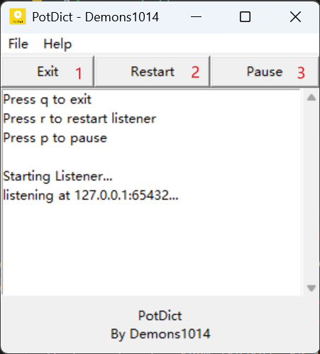
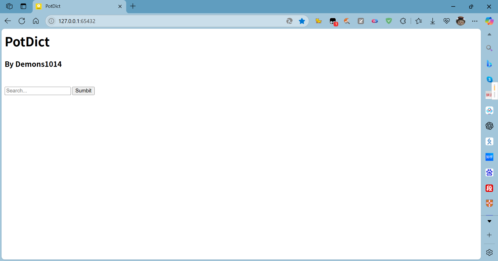
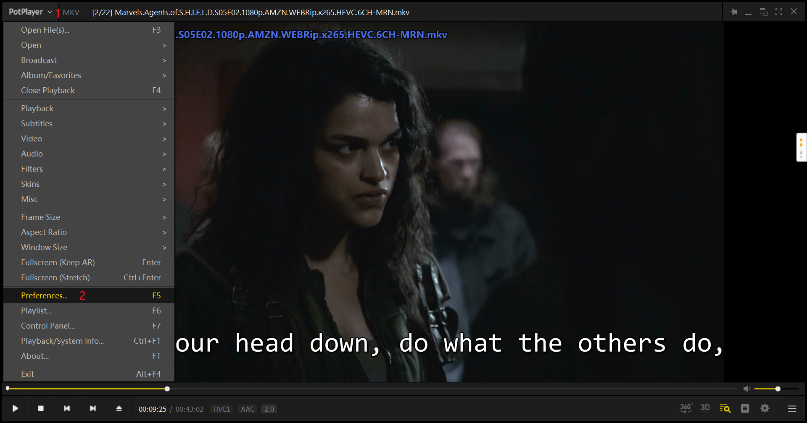
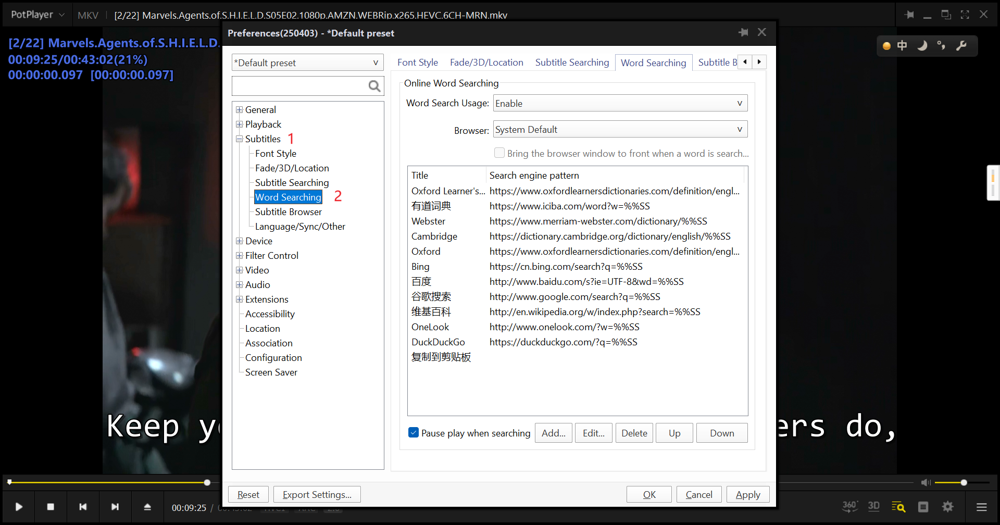
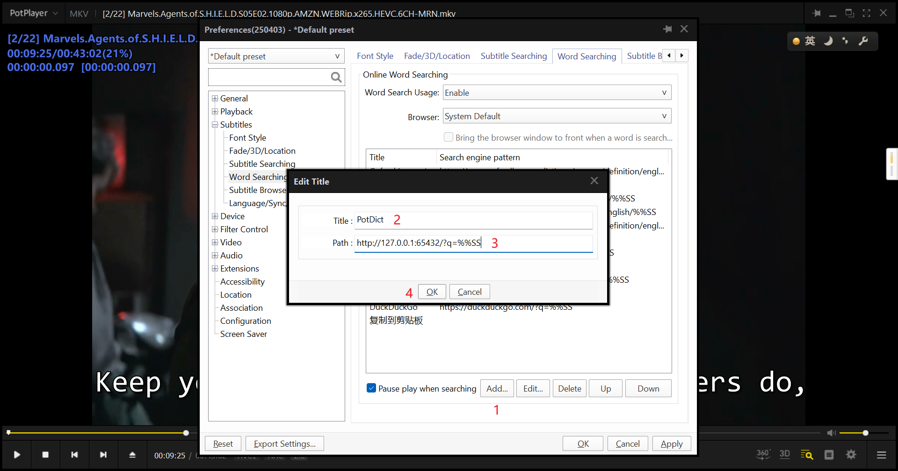
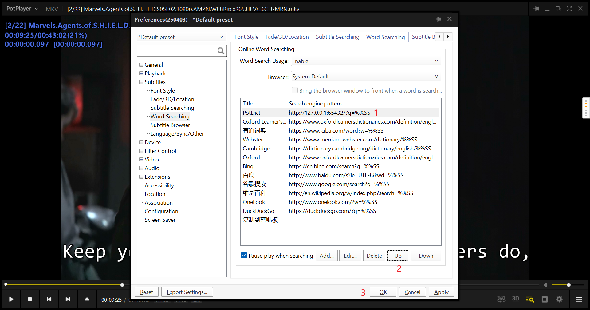
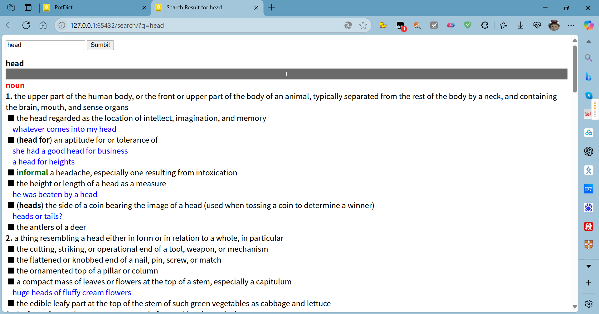

# PotDict V0.5.1

PotDict is a addon dictionary application for PotPlayer.

## Requirements:

PotDict works pretty well on Windows64, but I haven't tested it on any other platforms.

If you want to run the source code, the following libraries will be required:

- `readmdict`
- `pyinstaller`

## Installation:

> There's no release yet, so please ignore the following part.

Download the zip file and extract the content to whatever place you feel like. Then run PotDict.exe. I recommend can create a desktop shortcut.

## Usage:

### Basic usage:



1. Exit PotDict
2. Restart listener
3. Start/Stop listener

Copy `127.0.0.1:65432` or other url displayed and paste it into your browser.

If you saw something like this, it means PotDict is running:



### Setup in PotPlayer

Open PotPlayer, open Preferences:



Go to Subtitles > Word Searching:



Click "Add" and enter PotDict and `http://127.0.0.1:65432/?q=%%SS`. Remember to replace this url with the actual url you are using:



Select PotDict and click "Up" until it's on the top. This way, PotDict will be the default word searching engine for PotPlayer:



After saving you changes, click a word in the subtitle. If you see a page like this, PotDict is working properly:



### Settings:

The you can change you settings by edit `settings.json` which in the same folder as PotDict.exe. You also open it by open PoDict and click File > Open Settings.json.

This is an example of `settings.json`

```json
{
    "window": {
        "width": 300,
        "height": 300,
        "start_pos_y": 100,
        "start_pos_x": 100,
        "resize": true
    },
    "network": {
        "host": "127.0.0.1",
        "port": 65432,
        "max_connect": 5,
        "timeout" : 7,
        "max_retries" : -1
    },
    "search": {
        "dict_paths": [
            "./dicts/Oxford Dictionary of English 2nd.mdx"
        ],
        "similar_words_shown" : 10
    },
    "log": {
        "log_level": "DEBUG",
        "print_log": false,
        "log_max_bytes": 1048576
    }
}
```

#### window

| Option      | Type       | Description                                                          |
| ----------- | ---------- | -------------------------------------------------------------------- |
| width       | number     | Initial width of the PotDict window.                                 |
| height      | number     | Initial height of the PotDict window.                                |
| start_pos_x | number     | Initial distance between the left boarder of window and the screen.  |
| start_pos_y | number     | Initial distance between the upper boarder of window and the screen. |
| resize      | true/false | Whether the user will be able to resize the window.                  |

#### network

| Option      | Type   | Description                                                                                     |
| ----------- | ------ | ----------------------------------------------------------------------------------------------- |
| host        | string | The IP PotDict will be listening.<br />(127.0.0.1 means the current computer's IP.)             |
| port        | number | The port PotDict will be listening.                                                             |
| max_connect | number | Maximum connection allow.<br />(This looks pretty useless, but I suggest you not to change it.) |
| timeout     | number | Connection timeout.                                                                             |
| max_retries | number | Maximum retries, set to -1 for infinite retries.                                                |

#### search

| Options             | Type          | Description                                                        |
| ------------------- | ------------- | ------------------------------------------------------------------ |
| dict_paths          | array{string} | A list of dictionaries to be loaded.                               |
| similar_words_shown | number        | number of similar words to be shown when definition was not found. |

#### log

| Option        | Type       | Description                                                                                                               |
| :------------ | ---------- | ------------------------------------------------------------------------------------------------------------------------- |
| log_level     | string     | Level of logging, levels from low to high are:<br /> "DEBUG"<br /> "INFO" <br />"WARNING" <br />"ERROR"<br /> "CRITICAL". |
| print_log     | true/false | Whether to print the log to console.                                                                                      |
| log_max_bytes | number     | Maximum size of the log file (bytes).                                                                                     |

For JSON syntax, check out [This](https://www.json.org/)

### Known Errors & Solutions:

- **If you saw a blank page when searching from PotPlayer, try to set the "Browser" option to "System Default" rather than "Internet Explorer". (Why are people still using IE in 2025?)**
- If the searching page is loading for a very long time, press Ctrl+F5 to refresh. If it's still not working, try to restart the listener.

  If you want to report a BUG or give me a recommendation, please create an Issue on the [GitHub Repository](https://github.com/askformeal/PotDict) or send an E-mail to `zeus1014_2023@163.com`. I'll be most grateful for your feedback.
